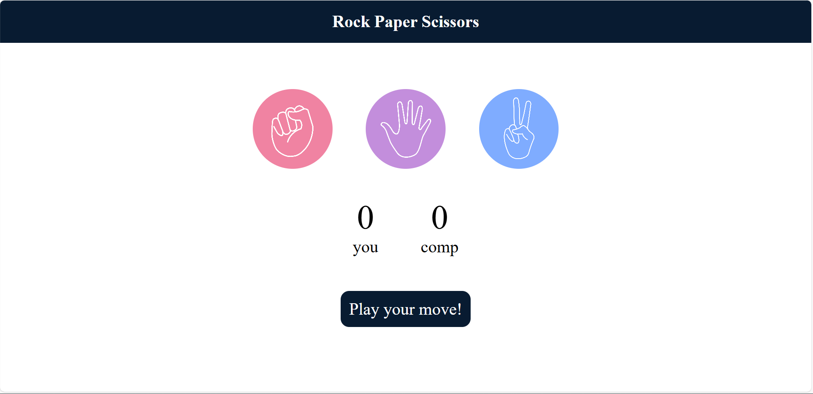

# Rock Paper Scissors Game

A fun and interactive Rock Paper Scissors game built using **HTML**, **CSS**, and **JavaScript**. Designed with a clean UI and dynamic score tracking, this game recreates the classic hand game with a colorful twist.

---

## Preview

> Here's how the interface looks:



> _Modern visuals, click-based gameplay, and live score updates._

---

## Tech Stack

- **HTML5** – Game structure and layout
- **CSS3** – Styling, transitions, and responsive UI
- **JavaScript** – Game mechanics, random computer moves, and score tracking

---

## How to Run

1. **Clone the repository**:

```bash
git clone https://github.com/bhoomibiradar/rock-paper-scissors.git
```

2. **Navigate to project folder**:

```bash
cd rock-paper-scissors
```

3. **Run with Live Server** *(recommended)*:
   - Open with VS Code
   - Right-click `index.html` → **Open with Live Server**

4. **OR** double-click `index.html` to launch in your browser.

---

## How to Play

1. Click on one of the three choices: **Rock**, **Paper**, or **Scissors**.
2. The computer will randomly select its move.
3. The result is displayed based on classic rules:
   - 🪨 Rock beats ✂️ Scissors
   - ✂️ Scissors beats 📄 Paper
   - 📄 Paper beats 🪨 Rock
4. Scores are updated after each round.
5. Play as many rounds as you like — best of luck!

---

## Features

- Colorful and animated UI
- Computer randomly selects moves
- Live score tracking for both player and computer
- Quick and intuitive interactions

---

## Author

Made with ❤️ by [Bhoomi](https://github.com/bhoomibiradar)  
[Portfolio Website](https://your-portfolio-link.com)

---

## License

This project is open source and available for personal or educational use.
